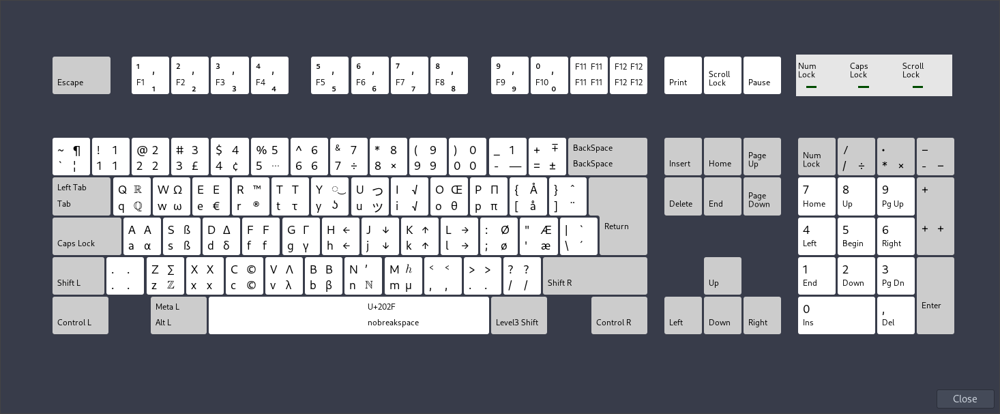

# NOUS - The ultimate keyboard
Nor(wegian|dic) + United States. Made with scandinavian keyboards in mind. Uses both Shift and AltGr to shift keys.

# Installation
```sh
# cp nous /usr/share/X11/xkb/symbols
$ setxkbmap nous
```
For a permanent setup:
```sh
# linux:   /etc/X11/xorg.conf.d/00-keyboard.conf
# openbsd: /usr/X11R6/share/X11/xorg.conf.d/00-keyboard.conf
# make the XkbOptions field empty if you don't want to swap those!
Section "InputClass"
        Identifier "system-keyboard"
        MatchIsKeyboard "on"
        Option "XkbLayout" "nous"
        Option "XkbModel" "pc102"
        Option "XkbOptions" "altwin:swap_lalt_lwin"
EndSection
```

# Arch package
You can build it yourself by running `makepkg -i` in that repo. `nous` is for the layout file, `switchlayout` is for the tty layout as described below.

# How to use with fcitx
Sort of unrelated but in case you also have trouble. I added a new input method. I searched for "nous" and selected "Keyboard - English (US)". I think it's conincidental it shows up. Move it to the top of the list, then Addons -> (Advanced) -> X Keyboard Integration -> (Configure) -> (Untick) Allow to Override System XKB Settings. Then restart and AltGr combos should now work, even with Japanese or whatever you may use! This also prevents fcitx from screwing up my capslock, escape and tab rebinds.

# Switching keys in tty
The switch.map can be used to switch tab with escape and control with capslock. It does *not* implement the rest of nous. It was edited from `/usr/share/keymaps/xkb/us.map.gz` on an alpine system. `kbd` is a requirement. Apparently keycodes can vary by system. If it doesn't work make your own by using `showkey` to find the codes. Install: `gzip -k switch.map && cp switch.map.gz /usr/share/keymaps/xkb/ && loadkeys switch`. Load automatically on login:
```sh
# .profile
loadkeys switch
```

# Preview

As you can see it also has some mathematical symbols, too.\
NOTE: AltGr+5 gives ‰ (per mille / promille), it is shortened to ... in the image.

# TODO
* Shift + AltGr + F2 → 1/2 etc
* Utilize the key between Shift and Z on ISO keyboards
