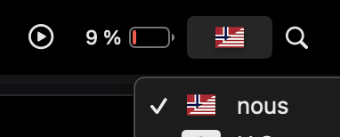
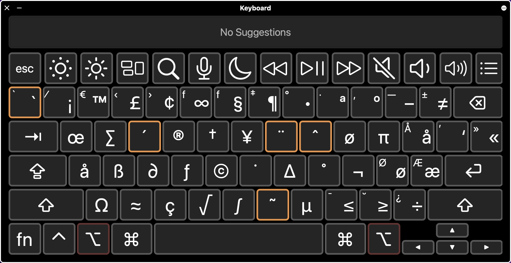
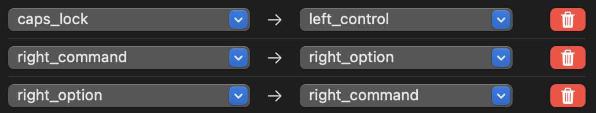

#  NOUS - The ultimate keyboard 

- [ NOUS - The ultimate keyboard](#-nous---the-ultimate-keyboard)
- [Preview](#preview)
- [Linux and OpenBSD](#linux-and-openbsd)
  - [Installation](#installation)
  - [X11 setup](#x11-setup)
  - [Wayland setup](#wayland-setup)
  - [Nix specific setup](#nix-specific-setup)
  - [Arch package](#arch-package)
  - [How to use with fcitx](#how-to-use-with-fcitx)
  - [Switching keys in tty](#switching-keys-in-tty)
- [MacOS](#macos)
  - [Installation](#installation-1)
  - [Other tips](#other-tips)

Nordic + United States. Made with scandinavian keyboards in mind. Uses both Shift and AltGr to shift keys.

# Preview


# Linux and OpenBSD
## Installation

Install the layout globally:

```sh
# cp nous /usr/share/xkeyboard-config-2
```

<details>
  <summary>
    (legacy instructions)
  </summary>

  Only do this if you have a xkeyboard-config prior to 2.45, or you
  [may not be able to update](https://bbs.archlinux.org/viewtopic.php?id=306180)

  ```sh
  # cp nous /usr/share/X11/xkb/symbols
  ```

  You can check `XKB_CONFIG_ROOT` if you're unsure.


</details>

<!-- ## Installation (user) -->
If you're the only user, you can install the layout just for yourself:

```sh
$ mkdir -p ~/.config/xkb/symbols
$ cp nous ~/.config/xkb/symbols
```

If you have XDG_CONFIG_HOME set, the path is `$XDG_CONFIG_HOME/xkb/symbols`.

## X11 setup
```sh
$ setxkbmap nous
```
For a permanent setup:
```sh
# linux:   /etc/X11/xorg.conf.d/00-keyboard.conf
# openbsd: /usr/X11R6/share/X11/xorg.conf.d/00-keyboard.conf
Section "InputClass"
    Identifier "system-keyboard"
    MatchIsKeyboard "on"
    Option "XkbLayout" "nous"
    Option "XkbModel" "pc102"
    # optional
    # Option "XkbOptions" "altwin:swap_lalt_lwin"
EndSection
```
## Wayland setup
Unlike X11, there is no uniform way to set keyboard layouts. You will have to
consult your compositor's documentation. For GNOME, you need to register the
layout properly:

```sh
$ mkdir -p ~/.config/xkb/rules
```

```xml
# ~/.config/xkb/rules/evdev.xml
<?xml version="1.0" encoding="UTF-8"?>
<!DOCTYPE xkbConfigRegistry SYSTEM "xkb.dtd">
<xkbConfigRegistry version="1.1">
  <layoutList>
    <layout>
      <configItem>
        <name>nous</name>
        <shortDescription>nous</shortDescription>
        <description>Norwegian US (nous)</description>
        <countryList>
          <iso3166Id>NO</iso3166Id>
          <iso3166Id>SE</iso3166Id>
          <iso3166Id>DK</iso3166Id>
        </countryList>
        <languageList>
          <iso639Id>eng</iso639Id>
          <iso639Id>nor</iso639Id>
          <iso639Id>nob</iso639Id>
          <iso639Id>nno</iso639Id>
          <iso639Id>swe</iso639Id>
          <iso639Id>dan</iso639Id>
        </languageList>
      </configItem>
      <variantList/>
    </layout>
  </layoutList>
</xkbConfigRegistry>
```

And it should appear in the list of keyboard layouts after restarting.

## Nix specific setup
In `/etc/nixos/configuration.nix`:
```nix
services.xserver.xkb = {
  layout = "nous";
  variant = "";
  extraLayouts.nous = {
    description = "nous";
    languages = [ "eng" "nor" "nob" "nno" "swe" "dan" ];
    symbolsFile = /etc/nixos/nous;
  };
};
```
And copy the nous file into `/etc/nixos/nous`.

## Arch package
You can build it yourself by running `makepkg -i` in that repo. `nous` is for the layout file, `switchlayout` is for the tty layout as described below.

## How to use with fcitx
Sort of unrelated but in case you also have trouble. I added a new input method. I searched for "nous" and selected "Keyboard - English (US)". I think it's conincidental it shows up. Move it to the top of the list, then Addons -> (Advanced) -> X Keyboard Integration -> (Configure) -> (Untick) Allow to Override System XKB Settings. Then restart and AltGr combos should now work, even with Japanese or whatever you may use! This also prevents fcitx from screwing up my capslock, escape and tab rebinds.

## Switching keys in tty
The `switch.map` can be used to switch tab with escape and control with capslock. It does *not* implement the rest of nous. It was edited from `/usr/share/keymaps/xkb/us.map.gz` on an alpine system. `kbd` is a requirement. Apparently keycodes can vary by system. If it doesn't work make your own by using `showkey` to find the codes. Install: `gzip -k switch.map && cp switch.map.gz /usr/share/keymaps/xkb/ && loadkeys switch`. Load automatically on login:
```sh
# .profile
loadkeys switch
```


# MacOS
The MacOS layout currently does not exactly correspond to the linux layout wrt. to all special symbols. It does however map `æøå` to `option`, in the same way `altgr`/`right alt` is used on linux.


## Installation
1.  move `nous.bundle` into Documents.
2.  use Ukulele's `File > Install > Show Organizer` to install
3. sign out and log back in
4. select `nous` from the top bar



## Other tips


I'd also recommend [Karabiner-Elements](https://karabiner-elements.pqrs.org/) for swapping the right cmd and option for easier layer switching.



